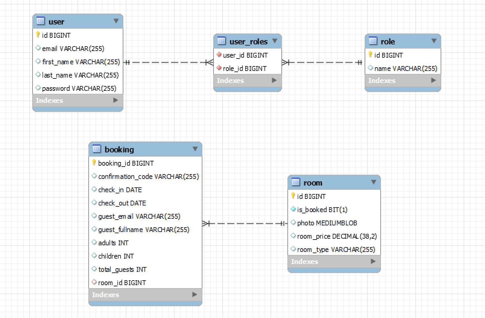
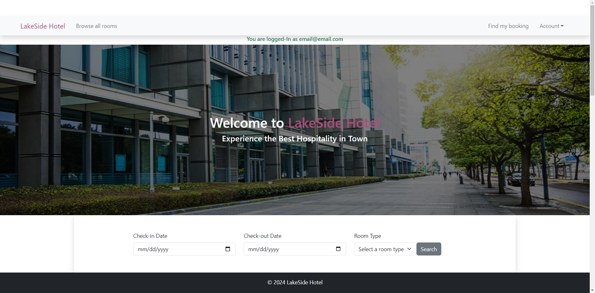
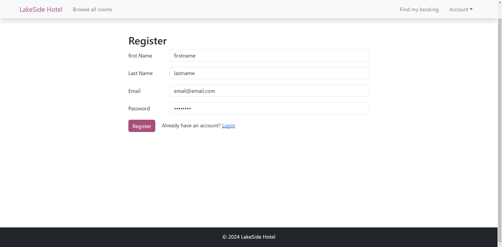
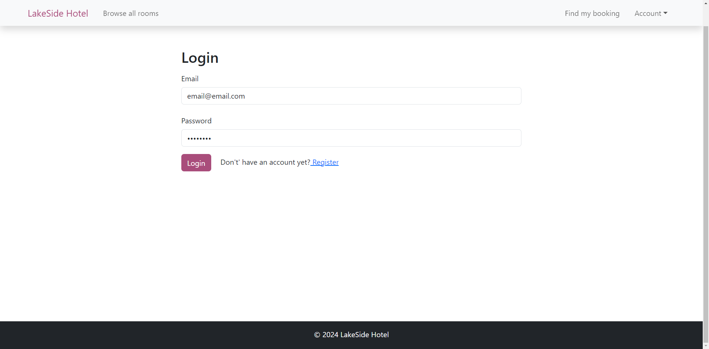
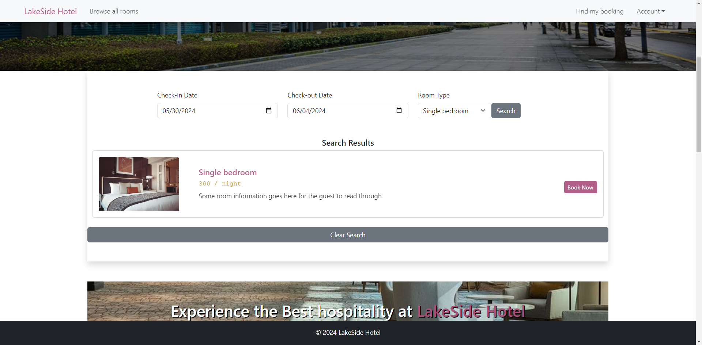
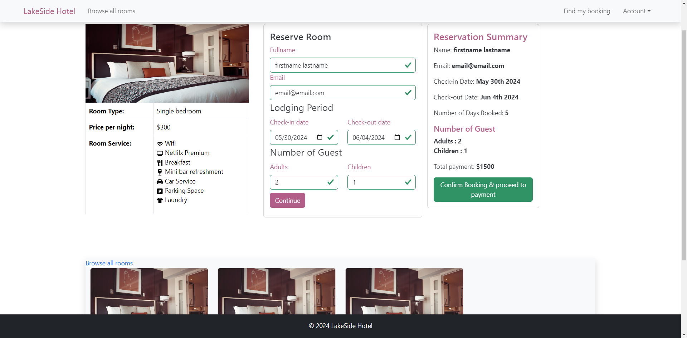
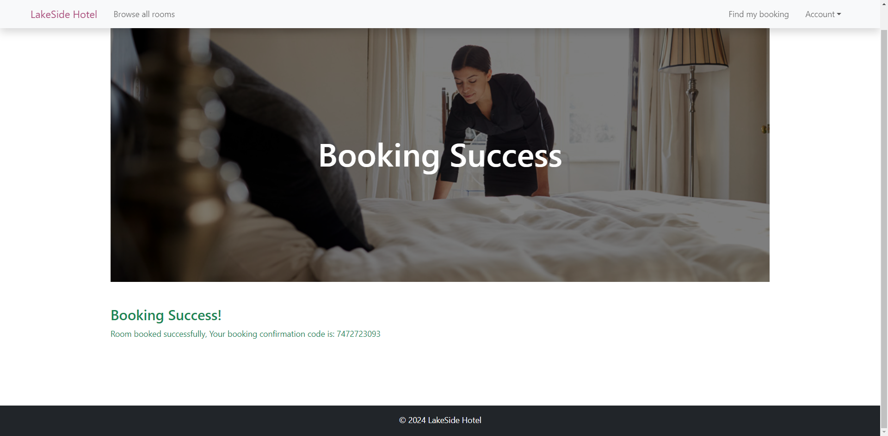
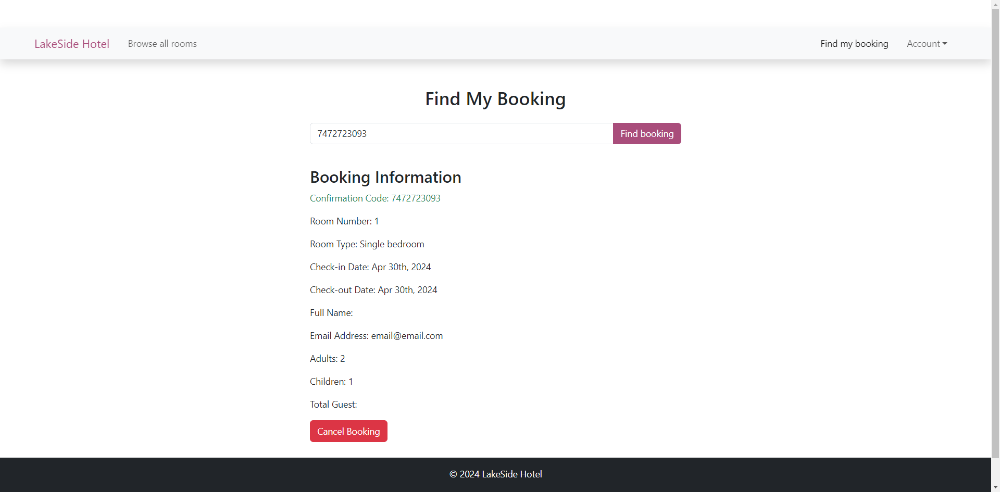
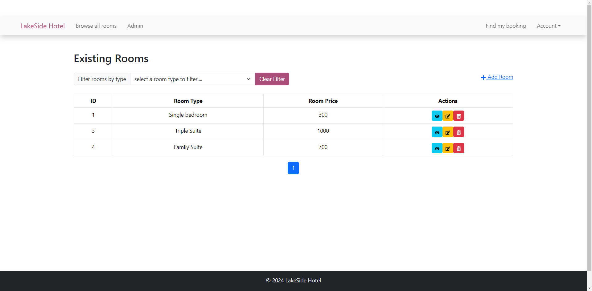
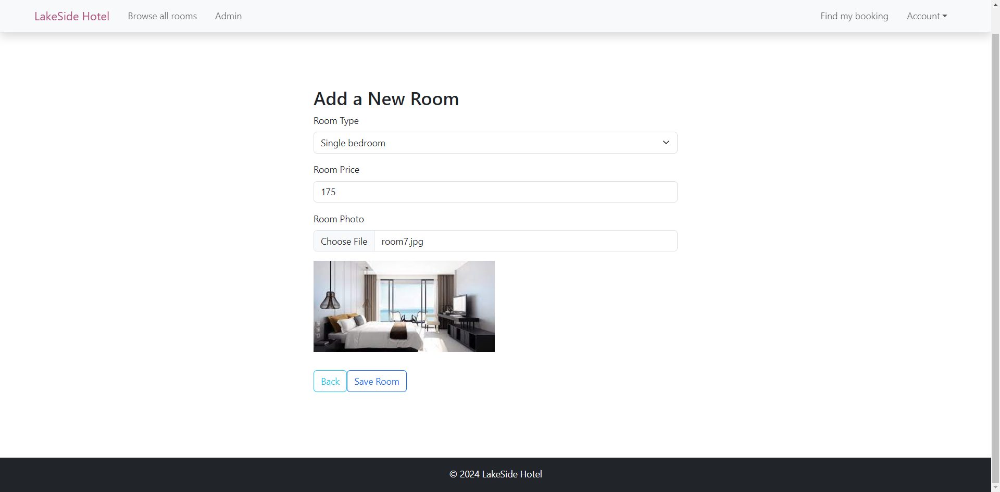

# Hotel Reservation

This project is for users to make reservation for hotel rooms

## Features

- User can login in and out
- User can view / reserve rooms
- Admin can manage rooms / bookings

## Tech Stack

## Entity Relationship Diagram

## Screenshots
- Main page

- Signup page

- Login page

- Room select

- Reservation form

- Confirmation

- Search booking

- Admin room management

- Admin add room

## Lessons Learned

- JWT token can be stored in browser's local storage, and can be used for API calls whenever needed
- Photo can be received as Multipart in the backend, and can be converted to BLOB to store image as a large object
- We can set photo as byte array in the response, or Base64 encoded so that the client application can render
